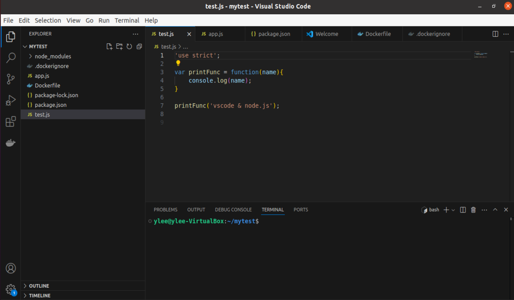
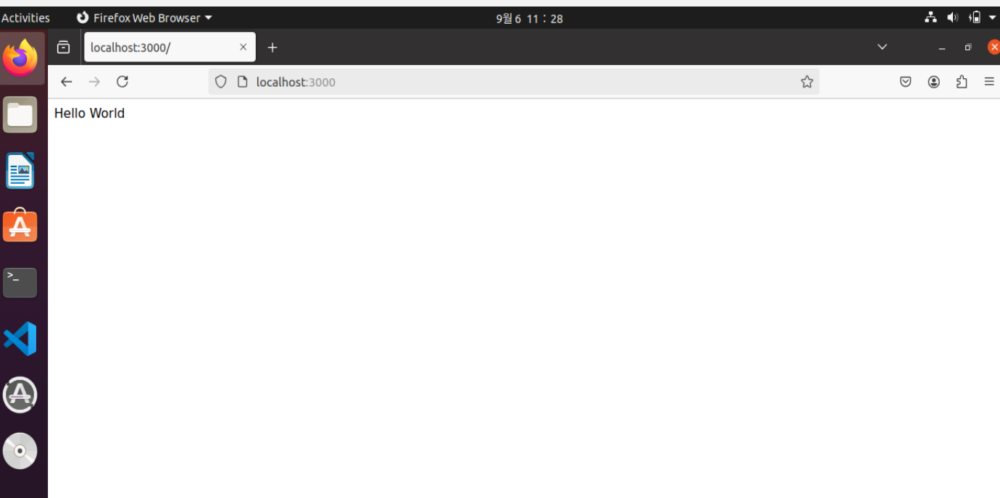
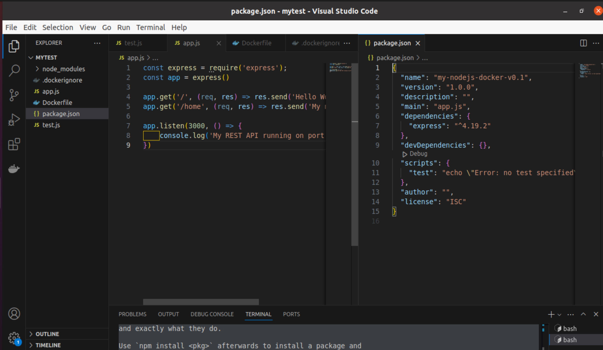
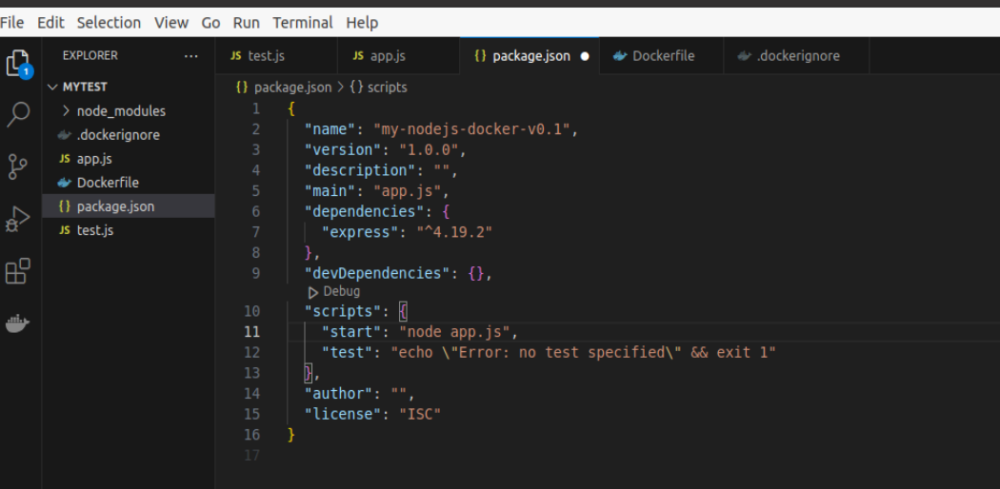
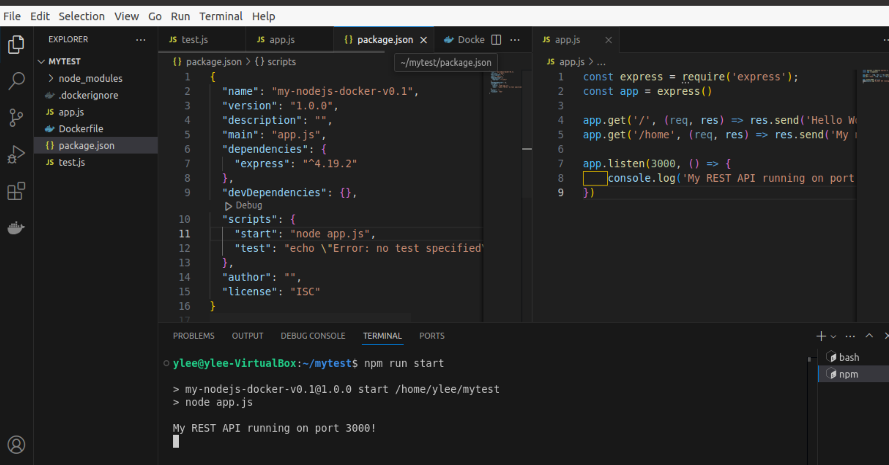
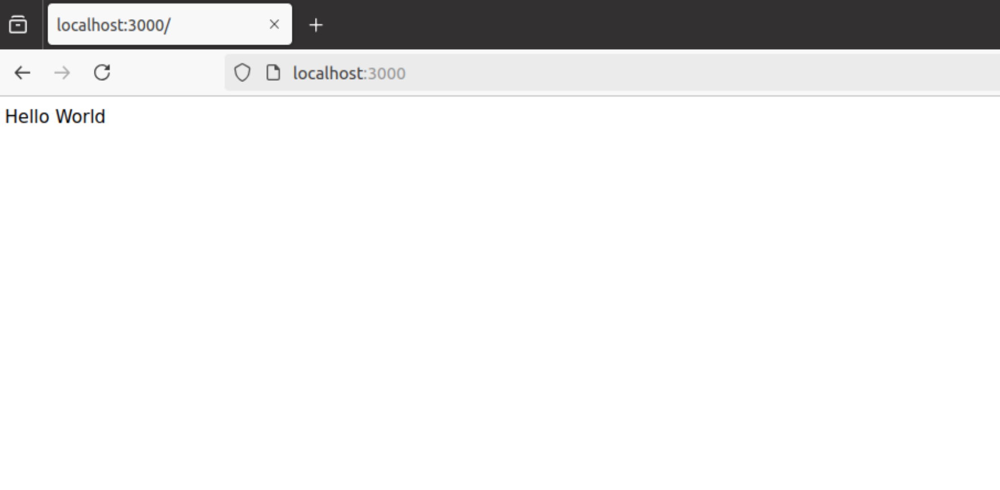
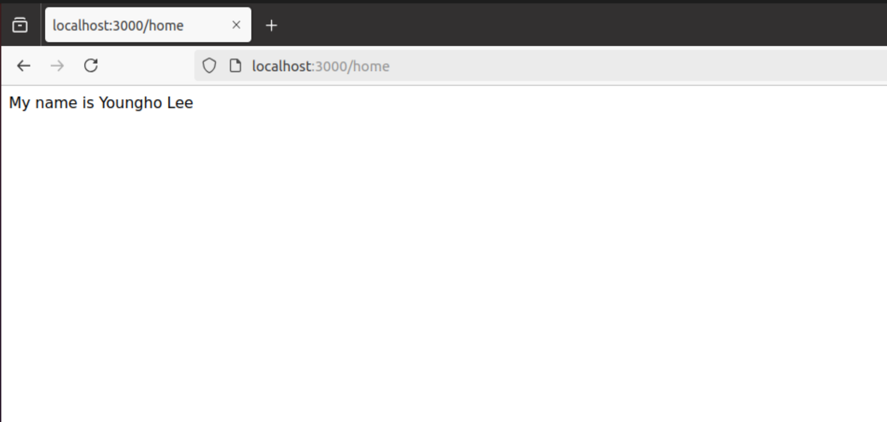
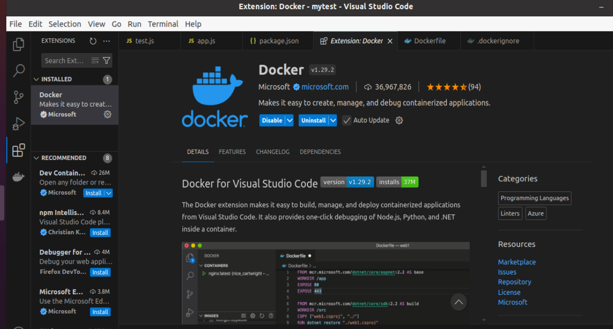
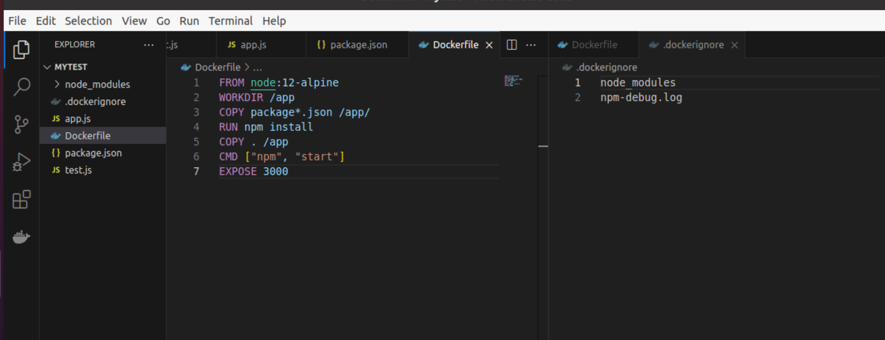
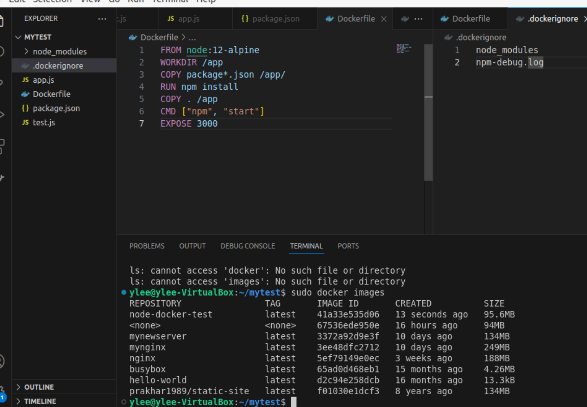

# 도커를 이용하여 Node.js 서버 만들기

이영호
국립목대학교컴퓨터공학과


## 시작하기

- 이번 과정은 우분투에 node.js를 설치하고 간단한 자바 스크립 서버를 만든다. 그리고 dockerfile을 만들어 도커 이미지를 만들어 사용하는 것이다. 실습을 위해서 자신의 컴퓨터의 OS를 사용할 수도 있지만, 가상머신을 사용하기 바란다. 윈도우면 virtual box, 맥OS는 UTM을 다운받아 설치 한 후 우분투를 설치한다. 우분투 설치후 sudo apt-get update를 실행한다. 

- 반드시 필요한건 아니지만 visual studio code 를 우분투에 설치하여 사용하여도 좋다. 

## Node.js 설치

- 먼저 Node.js가 설치되어 있지 않다면 사이트([click](https://nodejs.org/en/download/package-manager))에서 설치 방법을 확인하고 따라해주세요. 여러가지 방법이 있습니다. 네이버나 다른 검색엔진에서 한글로된 친절할 설명을 찾아 읽어 보아도 좋습니다. 

- 우분투에서 폴더를 하나 생성하고, *test.js* 라는 이름으로 파일을 하나 생성 후 다음 코드를 작성합니다. 리눅스에서 폴더를 생성하는 명령어는 mkdir입니다. 그리고 파일 작성은 vi 에디터나 비주얼 스튜디오 코드를 이용하세요. 

```javascript
'use strict';

var printFunc = function(name) {
    console.log(name);
}

printFunc('vscode & node.js');
```





- F5를 눌러 실행시켜주면 다음과 같은 화면이 뜨는데 Node.js를 눌러 실행시켜주면 됩니다. 정상 작동이 되면 Node.js 개발환경이 준비되었습니다. 그림\ref{fig:testjs}처럼 비주얼 스튜디오 코드를 이용하여 코드를 작성 한 후 F5를 누릅니다. 그리고 웹브라우저를 실행하여 http://localhost:3000 주소창에 입력하면 그림\ref{fig:testjsresult}처럼 자바스크립으로 작성한 홈페이지를 볼 수 있습니다. 

---

## app.js 작성

- 자, 이제 테스르를 마쳤으니 본격적으로 node js 서버를 만들어 봅시다. 

```javascript
const express = require('express');
const app = express();

app.get('/', (req, res) => res.send('Hello World'));
app.get('/home', (req, res) => res.send('My name is Youngho Lee'));

app.listen(3000, () => {
    console.log('My REST API running on port 3000!');
});
```

- 작성 후, 터미널에서 해당 폴더로 이동 후 명령어를 입력합니다. VS Code일 경우 ** Ctrl + \ ** 또는 TERMINAL을 누르면 해당 폴더로 이동된 터미널 사용이 가능합니다.

```shell
$ npm init
```

- npm init 명령어를 입력하고 나면, 패키지명을 입력하라는 창이 나옵니다. 원하는 패키지 명을 입력하는 엔터키를 누릅니다. 완료되면 패키지 정보를 담고 있는 **package.json** 파일이 생성됩니다. 이 파일은 폴더에 있습니다. 중요한 파일입니다. 아래 실행 결과 그림을 보면 이해될 겁니다. 

```shell
ylee@ylee-VirtualBox:~/mytest$ npm init
This utility will walk you through creating a package.json file.
It only covers the most common items, and tries to guess sensible defaults.

See `npm help json` for definitive documentation on these fields
and exactly what they do.

Use `npm install <pkg>` afterwards to install a package and
save it as a dependency in the package.json file.

Press ^C at any time to quit.
package name: (mytest) my-nodejs-docker-v0.1
version: (1.0.0) 
description: 
entry point: (app.js) 
test command: 
git repository: 
keywords: 
author: 
license: (ISC) 
About to write to /home/ylee/mytest/package.json:

{
  "name": "my-nodejs-docker-v0.1",
  "version": "1.0.0",
  "description": "",
  "main": "app.js",
  "dependencies": {
    "express": "^4.19.2"
  },
  "devDependencies": {},
  "scripts": {
    "test": "echo \"Error: no test specified\" && exit 1"
  },
  "author": "",
  "license": "ISC"
}

Is this OK? (yes) 
ylee@ylee-VirtualBox:~/mytest$ 
```



- 그 다음, Express를 설치해줍니다. express가 무엇인지는 다음 홈페이지를 참고하세요. (https://expressjs.com/ko/starter/installing.html)완료되면 **package.json** 파일에 Express가 추가됩니다. 

```shell
$ npm install --save express
```

- package.json 파일을 열어 시작 앱을 그림처럼 **app.js**로 지정합니다. 



```shell
npm run start
```

- 실행 후, 크롬 브라우저로 접속 후, **localhost:3000**과 **localhost:3000/home** 으로 들어가면, **app.js** 화면이 띄워지게 됩니다. 아래 그림을 보면 우리가 만든 서버가 잘 동작함을 알 수 있습니다. 







## Dockerfile 생성 및 빌드

- 비주얼 스튜디오 코드의 Extension에서 Docker 검색해서 Docker 플러그인을 설치합니다. 아래 그림을 보면 왼쪽의 탭에서 확장을 선택하여 검색하는 것을 볼 수 있습니다. 



- 이제 같은 폴더에서 비주얼 스튜디오 코드에서 **Dockerfile**을 생성하고 다음과 같이 작성해 줍니다.



```dockerfile
FROM node:12-alpine
WORKDIR /app
COPY package*.json /app
RUN npm install
COPY . /app
CMD [ "npm", "start" ]
EXPOSE 3000
```

1. Docker Hub에 있는 \texttt{node:12-alpine} 이미지 사용
2. 이미지 안에 애플리케이션 코드를 넣기 위한 디렉터리 생성. 애플리케이션의 작업 디렉터리가 됩니다.
3. **node:12** 이미지에 Node.js와 npm은 설치되어 있으므로 npm 바이너리로 앱 의존성만 설치합니다.
4. npm 설치 (\texttt{RUN}은 새로운 레이어 위에서 명령어를 실행, 주로 패키지 설치용)
5. Docker 이미지 안에 앱의 소스코드를 넣기 위함
6. **CMD** 는 도커가 실행될 때 실행되는 명령어를 정의합니다.
7. 3000번 포트로 실행
- 이는 Dockerfile에 위 스텝들을 캐싱해 놓는다고 생각하시면 됩니다. 애플리케이션을 수정하거나 rebuild할 때마다 위 Dockerfile은 위 스텝들을 다시 진행하지 않게 해줍니다.

- 빌드 전, **.dockerignore** 파일을 생성하여 Docker image의 파일 시스템의 **node\_modules** 디렉터리가 현재 로컬 작업 디렉터리의 **node\_modules** 디렉터리로 덮어지지 않도록 합니다.

```shell
  $  sudo docker build -t my-nodejs-docker-v0.1 .
[sudo] password for ylee: 
[+] Building 1.6s (10/10) FINISHED                                                                    docker:default
 => [internal] load build definition from Dockerfile                                                            0.0s
 => => transferring dockerfile: 155B                                                                            0.0s
 => [internal] load metadata for docker.io/library/node:12-alpine                                               1.5s
 => [internal] load .dockerignore                                                                               0.0s
 => => transferring context: 66B                                                                                0.0s
 => [1/5] FROM docker.io/library/node:12-alpine@sha256:d4b15b3d48f42059a15bd659be60afe21762aae9d6cbea6f1244408  0.0s
 => [internal] load build context                                                                               0.0s
 => => transferring context: 147B                                                                               0.0s
 => CACHED [2/5] WORKDIR /app                                                                                   0.0s
 => CACHED [3/5] COPY package*.json /app/                                                                       0.0s
 => CACHED [4/5] RUN npm install                                                                                0.0s
 => CACHED [5/5] COPY . /app                                                                                    0.0s
 => exporting to image                                                                                          0.0s
 => => exporting layers                                                                                         0.0s
 => => writing image sha256:41a33e535d06a14739f19c83c75f6b93ad7464e193c4700901a448b89f5d3a60                    0.0s
 => => naming to docker.io/library/my-nodejs-docker-v0.1  
```

- 그리고 Container Image를 도커로 빌드합니다. 이때 도커가 실행되고 있어야 하니, Docker QuickStart Terminal을 연 상태에서 빌드해주어야 합니다.

```shell
  $ sudo docker images
  REPOSITORY                TAG       IMAGE ID       CREATED          SIZE
  my-nodejs-docker-v0.1     latest    41a33e535d06   12 minutes ago   95.6MB
  <none>                    <none>    67536ede950e   16 hours ago     94MB
  mynewserver               latest    3372a92d9e3f   10 days ago      134MB
  mynginx                   latest    3ee48dfc2712   10 days ago      249MB
  nginx                     latest    5ef79149e0ec   3 weeks ago      188MB
  busybox                   latest    65ad0d468eb1   15 months ago    4.26MB
  hello-world               latest    d2c94e258dcb   16 months ago    13.3kB
  prakhar1989/static-site   latest    f01030e1dcf3   8 years ago      134MB
```

- 방금 빌드한 이미지를 확인합니다.



## 컨테이너 실행

- 다음 명령어로 Docker Container로 빌드된 이미지를 실행시킵니다. -p 5000:3000의 의미는 Host 포트 5000으로 들어오는 트래픽을 Container의 포트 3000으로 포워딩 시키는 것입니다. 

- **app.js**에서 작성한 로그 \texttt{My REST API running on port 3000!} 문구와 함께 \texttt{app.js}가 실행되었다는 화면을 볼 수 있습니다.

```shell
  $ sudo docker run -p 5000:3000 my-nodejs-docker-v0.1

  > my-nodejs-docker-v0.1@1.0.0 start /app
  > node app.js

  My REST API running on port 3000!
```

- 지금까지 여러분이 실행한 명령어와 옵션을 극히 일부입니다. 더 많은 옵션과 명령어가 있습니다. 하나하나 찾아보면서 실행해 보시기 바랍니다. 
  참고로 명령어에 `-h' 옵션을 붙이면 모든 명령어에 필요한 정보를 얻을 수 있습니다. 

```shell
$  docker -h
Flag shorthand -h has been deprecated, use --help

Usage:  docker [OPTIONS] COMMAND

A self-sufficient runtime for containers

Common Commands:
  run         Create and run a new container from an image
  exec        Execute a command in a running container
  ps          List containers
  build       Build an image from a Dockerfile
  pull        Download an image from a registry
  push        Upload an image to a registry
  images      List images
```

---

# Docker 명령어

## 도커 기본 명령어

- `docker --version` : 도커 버전을 확인합니다.
- `docker info` : 도커 시스템에 대한 자세한 정보를 출력합니다.
- `docker help` : 도커 명령어에 대한 도움말을 표시합니다.

## 이미지 관련 명령어

- `docker pull [이미지 이름]` : 도커 허브에서 이미지를 다운로드합니다.
- `docker images` : 다운로드된 모든 이미지를 나열합니다.
- `docker rmi [이미지 ID]` : 특정 이미지를 삭제합니다.
- `docker build -t [이미지 이름] .` : 현재 디렉토리의 Dockerfile을 사용해 이미지를 빌드합니다.

## 컨테이너 관련 명령어

- `docker run [옵션] [이미지 이름]` : 컨테이너를 생성하고 실행합니다.
  - 예: `docker run -it --name my_container ubuntu /bin/bash`
- `docker ps` : 현재 실행 중인 모든 컨테이너를 나열합니다.
- `docker ps -a` : 중지된 컨테이너를 포함한 모든 컨테이너를 나열합니다.
- `docker stop [컨테이너 ID]` : 실행 중인 컨테이너를 중지합니다.
- `docker start [컨테이너 ID]` : 중지된 컨테이너를 다시 시작합니다.
- `docker restart [컨테이너 ID]` : 컨테이너를 재시작합니다.
- `docker rm [컨테이너 ID]` : 특정 컨테이너를 삭제합니다.
- `docker exec -it [컨테이너 이름] /bin/bash` : 실행 중인 컨테이너에 접속합니다.

## 네트워크 관련 명령어

- `docker network ls` : 모든 네트워크를 나열합니다.
- `docker network create [네트워크 이름]` : 새로운 네트워크를 생성합니다.
- `docker network connect [네트워크 이름] [컨테이너 이름]` : 컨테이너를 네트워크에 연결합니다.
- `docker network disconnect [네트워크 이름] [컨테이너 이름]` : 컨테이너를 네트워크에서 분리합니다.

## 볼륨 관련 명령어

- `docker volume ls` : 모든 볼륨을 나열합니다.
- `docker volume create [볼륨 이름]` : 새로운 볼륨을 생성합니다.
- `docker volume rm [볼륨 이름]` : 특정 볼륨을 삭제합니다.

## 로그 및 상태 확인 명령어

- `docker logs [컨테이너 이름]` : 컨테이너의 로그를 출력합니다.
- `docker top [컨테이너 이름]` : 컨테이너 내부의 프로세스를 나열합니다.
- `docker stats` : 모든 실행 중인 컨테이너의 실시간 리소스 사용량을 표시합니다.

## 도커 컴포즈 관련 명령어

- `docker-compose up` : 정의된 모든 서비스(컨테이너)를 시작합니다.
- `docker-compose down` : 정의된 모든 서비스를 중지하고 네트워크를 삭제합니다.
- `docker-compose ps` : 컴포즈로 실행 중인 서비스(컨테이너)를 나열합니다.

# Dockerfile 작성법

## Dockerfile이란?

Dockerfile은 도커 이미지를 생성하기 위한 명령어들의 집합을 포함한 텍스트 파일입니다. Dockerfile은 특정 이미지의 빌드 과정을 자동화하고 일관된 환경을 제공하기 위해 사용됩니다.

## Dockerfile 작성 방법

- `FROM` : 베이스 이미지를 설정하는 명령어로, Dockerfile의 첫 번째 명령어로 사용됩니다. 예: `FROM ubuntu:latest`
- `LABEL` : 이미지에 메타데이터(작성자 정보 등)를 추가합니다.
- `WORKDIR` : 작업 디렉토리를 설정하며, 이후 명령어들은 설정된 디렉토리에서 실행됩니다.
- `COPY` : 파일이나 디렉토리를 호스트에서 컨테이너로 복사합니다. 예: `COPY . /app`
- `RUN` : 컨테이너 빌드 중에 실행할 명령어를 지정합니다. 패키지 설치 등에 사용됩니다. 예: `RUN apt-get update && apt-get install -y python3`
- `EXPOSE` : 컨테이너가 사용할 포트를 명시합니다.
- `CMD` : 컨테이너가 시작될 때 실행할 명령어를 지정합니다. 이 명령어는 Dockerfile에서 한 번만 사용되며, 일반적으로 컨테이너의 기본 프로세스를 지정합니다.
- `ENTRYPOINT` : `CMD`와 유사하게 컨테이너 실행 시 실행할 명령어를 지정하지만, 항상 실행됩니다. `CMD`와 함께 사용될 수 있습니다.

## Dockerfile 예제

아래는 간단한 Python 애플리케이션을 위한 Dockerfile의 예제입니다.

```dockerfile
FROM python:3.9
WORKDIR /app
COPY requirements.txt ./
RUN pip install --no-cache-dir -r requirements.txt
COPY . .
EXPOSE 5000
CMD ["python", "app.py"]
```

---